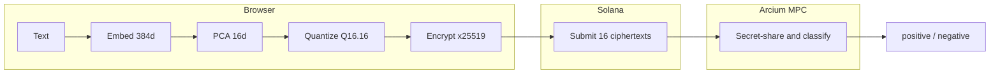

# ArcInfer

Private sentiment classification powered by multi-party computation on Solana.

ArcInfer classifies text as positive or negative without ever exposing the input. The entire inference pipeline — from embedding to classification — runs on encrypted data using [Arcium](https://arcium.com)'s MPC network.

## Demo
https://github.com/user-attachments/assets/de903c23-3315-4705-8cd3-96d9e5abd079


## How It Works



1. **Browser** — Text is tokenized and embedded into a 384-dim vector using all-MiniLM-L6-v2 (ONNX/WASM), reduced to 16 dims via PCA, quantized to Q16.16 fixed-point, then encrypted with the MPC cluster's public key
2. **Solana** — A transaction carries the 16 ciphertexts on-chain and queues MPC computation
3. **Arcium** — MPC nodes secret-share the data and evaluate a neural network collaboratively — no single node ever sees the input
4. **Solana** — The classification result (positive / negative) is emitted via a callback event

## Architecture

```text
crates/
  arcinfer-core/         Zero-dep Rust library: fixed-point math, NN layers, classifier
  arcinfer-inference/    Client-side pipeline: tokenizer, ONNX embedding, PCA, quantization
  arcinfer-pipeline/     Integration tests and weight loading utilities

programs/
  arcinfer/              Solana/Anchor program: on-chain orchestration and MPC callbacks

encrypted-ixs/           Arcis MPC circuits: encrypted neural network evaluation

app/                     Next.js frontend: wallet connection, encryption, progress tracking

training/                Python training pipeline (PyTorch → ONNX → PCA → Q16.16 weights)
```

### Neural Network

| Property | Value |
| --- | --- |
| Architecture | 16 → 16 → 8 → 2 (fully connected) |
| Activation | x² (MPC-friendly, no comparisons needed) |
| Parameters | 426 |
| Precision | Q16.16 fixed-point (32-bit integers, 16 fractional bits) |
| Accuracy | 80.2% on SST-2 sentiment benchmark |

## Prerequisites

- [Rust](https://rustup.rs/) (nightly, managed via `rust-toolchain.toml`)
- [Solana CLI](https://docs.solana.com/cli/install-solana-cli-tools) v1.18+
- [Anchor](https://www.anchor-lang.com/docs/installation) v0.32+
- [Arcium CLI](https://docs.arcium.com/)
- [Node.js](https://nodejs.org/) v18+
- [Yarn](https://yarnpkg.com/) v1.22+

## Build & Test

### Rust crates

```bash
cargo test --workspace --exclude arcinfer --exclude arcis-arcinfer
```

### Solana program + MPC circuits

Circuits are stored offchain on IPFS. Set their URLs before building:

```bash
export CLASSIFY_CIRCUIT_URL="<your-ipfs-gateway>/bafybeigjlp3cywmyd6xufivziaeedzfvlig6u2z6m4afsslaphmbblenzi"
export CLASSIFY_REVEAL_CIRCUIT_URL="<your-ipfs-gateway>/bafybeidgrpe3wvpr3b3p46ipc4nmsjguwq3afe47o5nxqvvcxwqe23bwuu"

arcium build
arcium test
```

Any IPFS gateway works (e.g. `https://ipfs.io/ipfs/`, `https://dweb.link/ipfs/`, or a Pinata dedicated gateway).

### Frontend

```bash
cd app
yarn install
yarn dev
```

The frontend needs model files and ONNX Runtime WASM binaries (not tracked in git):

```bash
# ONNX model for in-browser embedding
mkdir -p app/public/models
curl -L -o app/public/models/model.onnx \
  "https://huggingface.co/Xenova/all-MiniLM-L6-v2/resolve/main/onnx/model.onnx"

# ONNX Runtime WASM binaries
mkdir -p app/public/onnx
cd app/public/onnx
curl -LO "https://cdn.jsdelivr.net/npm/onnxruntime-web@1.21.0/dist/ort-wasm-simd-threaded.jsep.wasm"
curl -LO "https://cdn.jsdelivr.net/npm/onnxruntime-web@1.21.0/dist/ort-wasm-simd.jsep.wasm"
```

## Devnet

| Resource | Value |
| --- | --- |
| Program ID | `2UEesrBiknFE3BoAh5BtZwbr5y2AFvWe2wksVi3MqeX9` |
| Network | Solana Devnet |
| Circuits | Hosted on IPFS, fetched by Arcium nodes at runtime |

## Tech Stack

- **Rust** — Core math, NN inference, fixed-point arithmetic
- **Solana / Anchor** — On-chain program, transaction orchestration
- **Arcium / Arcis** — MPC circuit definition, encrypted computation
- **TypeScript / Next.js** — Frontend with browser-side ONNX inference
- **ONNX Runtime (WASM)** — In-browser sentence embedding (all-MiniLM-L6-v2)
- **Tailwind CSS** — UI styling

## License

[MIT](LICENSE)
